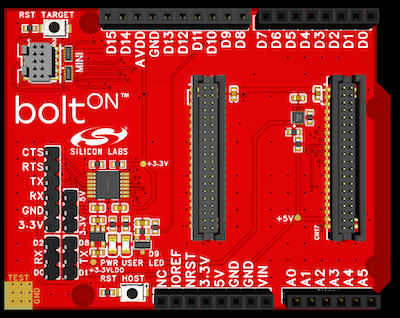
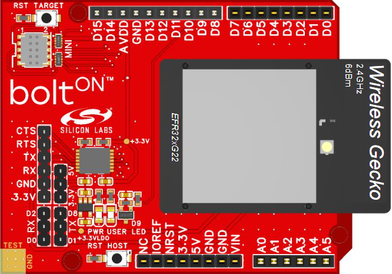
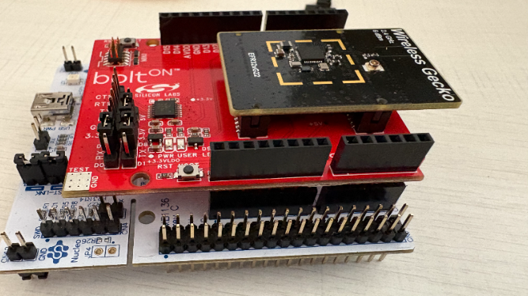
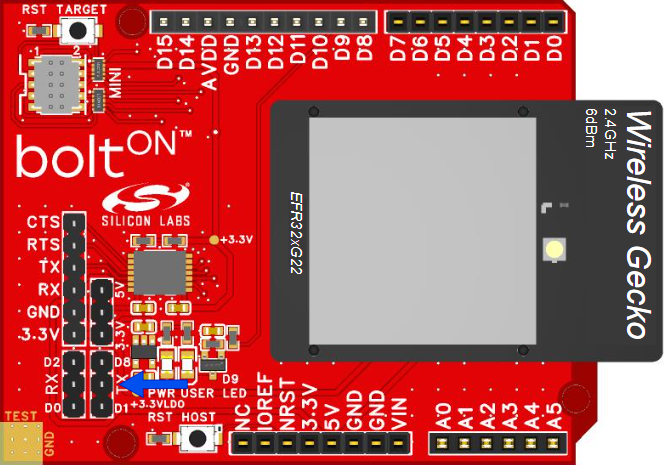
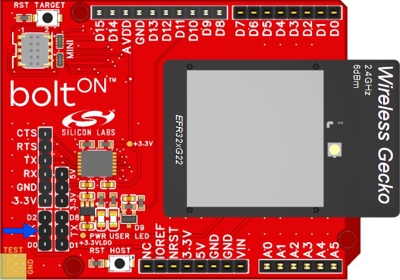
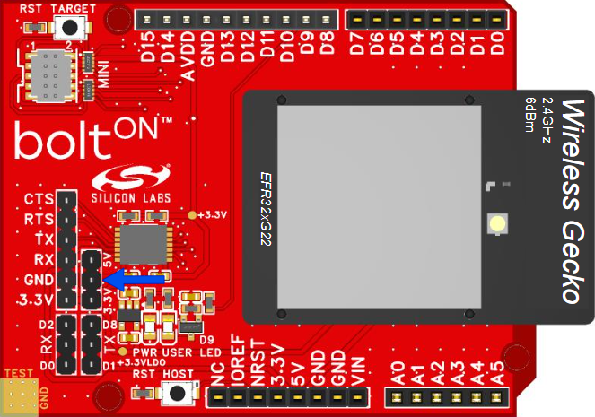

# Silicon Labs boltON #

## Overview ##

 **by Silicon Labs**

**boltON** is a versatile expansion board designed to seamlessly integrate wireless connectivity into a wide range of development kits. By providing a standardized interface and robust hardware support, boltON enables rapid prototyping and evaluation of wireless solutions. This board is ideal for engineers and developers seeking to enhance their projects with reliable wireless communication capabilities, while maintaining compatibility with the ecosystem and third-party platforms of Silicon Laboratories.

The hardware is an open-source Arduino Uno shield form factor PCB, which can be bolted on top of your existing developer boards.

---

## Table Of Contents ##

- [Hardware Overview](#hardware-overview)
  - [Feature](#feature)
- [Prerequisites](#prerequisites)
  - [Hardwares](#hardwares)
  - [Softwares](#software)
- [What is included in the boltON project](#what-is-included-in-the-bolton-project)
  - [Design](#design)
  - [PCB/PCBA Order File](#pcbpcba-order-file)
- [User's Guide](#users-guide)
  - [Hardware Installation Guide](#hardware-installation-guide)
  - [Software Guide](#software-guide)
- [Report Defects & Get Support](#report-defects--get-support)

---

## Hardware Overview ##

### Feature ###

- **Arduino Uno Shield Connector:** Adheres to the standard Arduino shield pinout for broad compatibility.
- **Radio Board Connector:** Enables seamless connection to Silicon Labs radio boards.
- **Mini Simplicity Connector:** Facilitates programming of the radio board using an external programmer.
- **Power LED:** Provides a clear indication of board power status.
- **User LED:** Connected to the D9 pin on the Arduino shield connector for user-defined signaling.
- **Host MCU Reset Button:** Allows convenient resetting of the host microcontroller.
- **Target MCU Reset Button:** Enables independent resetting of the radio board.
- **UART Header (CTS/RTS/TX/RX/GND/3.3V):** Exposes the UART interface of the radio board for easy external access.
- **Host MCU Voltage Selector (5V/3.3V):** Select the operating voltage for the host MCU using a jumper. When 5V is selected, an onboard level shifter ensures safe voltage conversion for the radio board, which always operates at 3.3V.
- **UART RX Pin Selection (D2/RX/D0):** Choose between D2 and D0 as the UART RX pin via jumper, accommodating different host board UART mappings.
- **UART TX Pin Selection (D8/TX/D1):** Select between D8 and D1 as the UART TX pin via jumper, providing flexibility for various host board configurations.

---

## Prerequisites ##

### Hardwares ###

- [Position Shunt Connector](https://www.digikey.hk/en/products/detail/w%C3%BCrth-elektronik/60900213421/2508447)

- Supported boards for the host:
  - [STM32 Nucleo F411RE](https://www.st.com/en/evaluation-tools/nucleo-f411re.html)
    - Please select the UART RX pin as D2 and the UART TX pin as D8 on the boltON hardware when using this kit
  - [STM32 Nucleo H743ZI2](https://www.st.com/en/evaluation-tools/nucleo-h743zi.html)

- Silicon Labs Radio Boards that are BLE compatible and need to be flashed with BLE NCP firmware:
  - [EFR32xG24 Wireless 2.4 GHz +10 dBm Radio Board](https://www.silabs.com/development-tools/wireless/xg24-rb4186c-efr32xg24-wireless-gecko-radio-board?tab=overview)
  - [EFR32xG22 Wireless Gecko 2.4 GHz +6 dBm, 4x4 QFN32 Radio Board](https://www.silabs.com/development-tools/wireless/slwrb4183a-efr32xg22-wireless-gecko-radio-board?tab=overview)

> [!NOTE]
>
> The list of supported hosts and Radio Boards is updated frequently.

### Software ###

- [EasyEDA](https://easyeda.com/) - a free, PCB designer tool.

---

## What is included in the boltON project ##

### Design ###

We provide a design file named [ProPrj_OHPP-001A-boltON](./ProPrj_OHPP-001A-boltON.epro) that you can open and edit using EasyEDA software.

This [guide](https://prodocs.easyeda.com/en/import-export/import-easyeda-pro/) shows how to import it to EasyEDA tool.

### PCB/PCBA Order File ###

You can conveniently order the PCB/PCBA through JLCPCB using EasyEDA, ensuring that all specified requirements are met.

| **PCBA Order Settings**     | **Specifications**                   |
|-----------------------------|--------------------------------------|
| **Base Material**           | FR-4                                 |
| **Layers**                  | 4                                    |
| **Dimension**               | 78.55 mm × 71.38 mm                  |
| **Product Type**            | Industrial / Consumer Electronics    |
| **PCB Thickness**           | 1.6 mm                               |
| **Specify Stackup**         | No requirement                       |
| **Material Type**           | FR4 - Standard TG 135-140            |
| **Via Covering**            | Plugged                              |
| **Outer Copper Weight**     | 1 oz                                 |
| **Inner Copper Weight**     | 0.5 oz                               |
| **Mark on PCB**             | Order Number (Specify Position)      |
| **Min Via Hole Size**       | 0.3 mm (Diameter: 0.4 / 0.45 mm)     |
| **Appearance Quality**      | IPC Class 2 Standard                 |
| **Board Outline Tolerance** | ±0.2mm(Regular)                      |

> [!NOTE]
>
> [Gerber](./Gerber_BoltON.zip), [Pick and Place](./PickAndPlace_BoltON.xlsx), [BOM](./BOM_Board1_BoltON.xlsx) files are also provided to easily work with other PCB/PCBA Manufacturers.

---

## User's Guide ##

### Hardware Installation Guide ###

| Steps              |               |
|--------------------|---------------|
| Setup Radio Board, boltON board, and the host  |    |
| Choose Tx Pin with Shunt Connector |  |
| Choose Rx Pin with Shunt Connector |  |
| Choose a logic voltage for Host board (3.3V or 5V) with Shunt Connector  |  |

### Software Guide ###

For detailed instructions on setting up and experimenting with the boltON module, please refer to the [boltON Software Examples repository](https://github.com/SiliconLabsSoftware/boltON). This resource provides comprehensive guides and example projects to help you get started with boltON software integration.

---

## Report Defects & Get Support ##

To report defects in the Open PCB/PCBA Prototypes projects, please create a new "Issue" in the "Issues" section of [open_pcb_prototypes](https://github.com/SiliconLabsSoftware/open-pcb-prototypes-staging) repo. Please reference the board, project, and and relevant hardware design files associated with the flaws, and reference line numbers. If you are proposing a fix, also include information on the proposed fix. Since these examples are provided as-is, there is no guarantee that these examples will be updated to fix these issues.

Questions and comments related to these examples should be made by creating a new "Issue" in the "Issues" section of [open_pcb_prototypes](https://github.com/SiliconLabsSoftware/open-pcb-prototypes-staging) repo.

---
