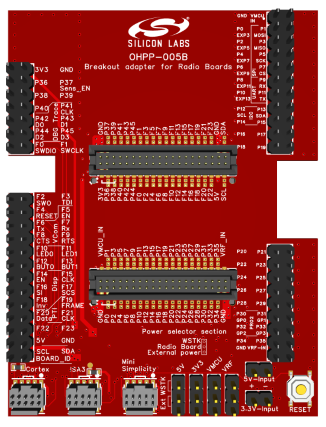
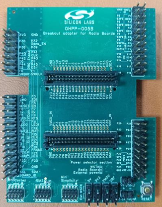
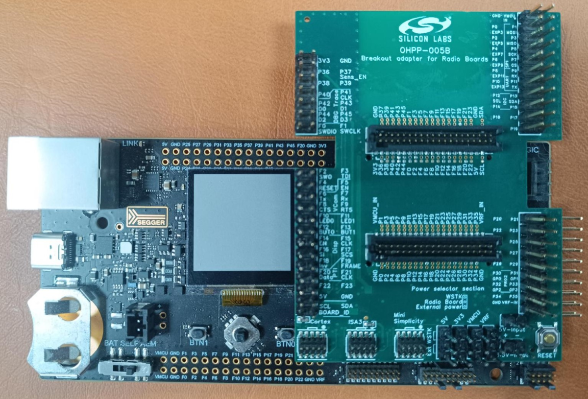
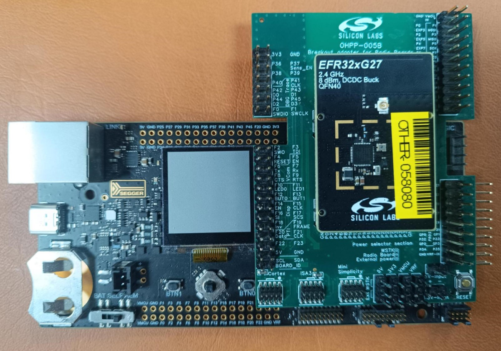
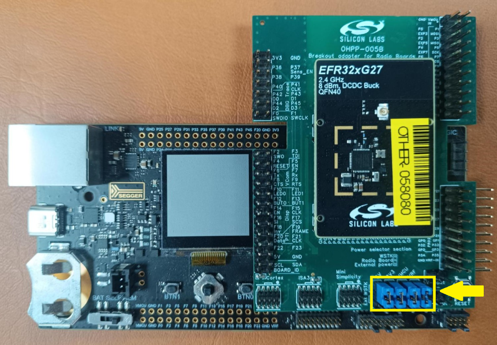
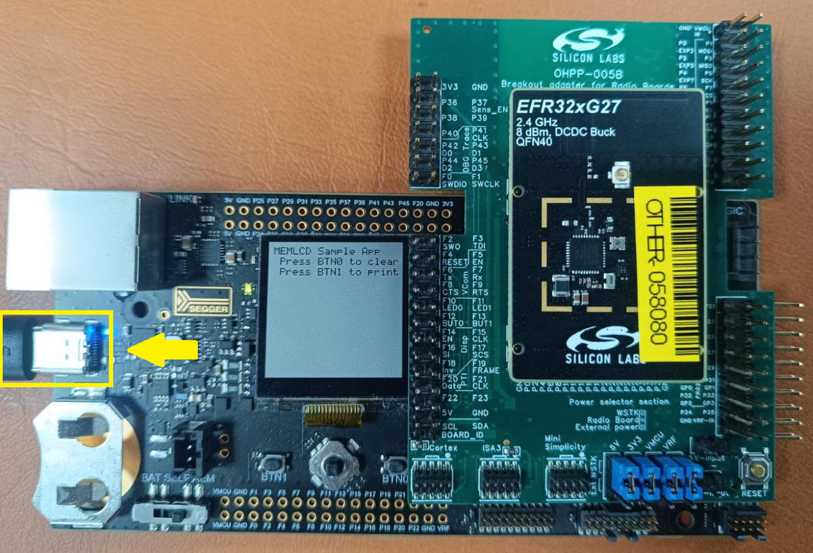
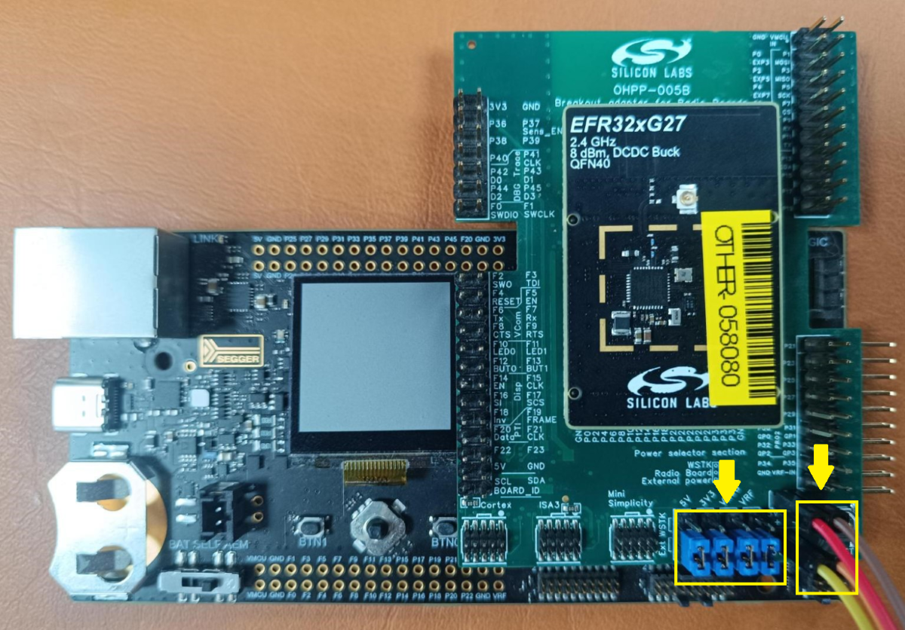
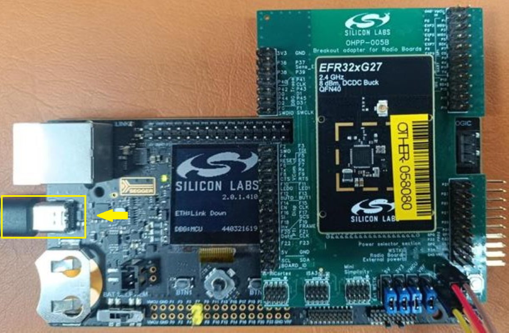

# Silicon Labs Breakout Adapter for Radio Boards #

## Overview ##

**Breakout Adapter for Radio Boards** is dedicated to accessing the radio board pins while the radio board is attached to the WSTK.
This is very useful for various power consumption measurement, debugging, and tracing use cases.

---

## Table Of Contents ##

- [Hardware Overview](#hardware-overview)
  - [Features](#features)
- [Prerequisites](#prerequisites)
  - [Hardware](#hardware)
  - [Software](#software)
- [What is included](#what-is-included)
  - [Design](#design)
  - [PCB/PCBA Order File](#pcbpcba-order-file)
- [User's Guide](#users-guide)
  - [Hardware Installation Guide](#hardware-installation-guide)
- [Report Defects & Get Support](#report-defects--get-support)

---

## Hardware Overview ##

|| |
|:-:|:-:|
|3D Design|Manufactured|

### Features ###

- **Host MCU Reset Button:** Quick reset of the microcontroller during development and testing.
- **Programming Headers:** Cortex Debug, ISA3, and Mini Simplicity interfaces for flexible programming and debugging.
- **Power Jumpers (5V / 3.3V):** Power the radio board and support for power consumption measurements.

---

## Prerequisites ##

### Hardware ###

- [Position Shunt Connector](https://www.digikey.hk/en/products/detail/w%C3%BCrth-elektronik/60900213421/2508447) - Required for proper board connections
- Wireless Pro Kit Mainboard: BRD4001A, BRD4002A
- 5V, 3.3V and GND cable and external 5V and 3.3V power supply
- All Silicon Labs radio boards are supported

### Software ###

- [EasyEDA](https://easyeda.com/) - a free, PCB designer tool.

---

## What is included ##

### Design ###

We provide a design file named [ProDoc_OHPP-005B](./ProDoc_OHPP-005B.epro) that you can open and edit using EasyEDA software.

This [guide](https://prodocs.easyeda.com/en/import-export/import-easyeda-pro/) shows how to import it to EasyEDA tool.

### PCB/PCBA Order File ###

You can conveniently order the PCB/PCBA through JLCPCB using EasyEDA, ensuring that all specified requirements are met.

| **PCBA Order Settings**     | **Specifications**                   |
|-----------------------------|--------------------------------------|
| **Base Material**           | FR-4                                 |
| **Layers**                  | 6                                   |
| **Dimension**               | 61 mm * 80 mm               |
| **Product Type**            | Industrial / Consumer Electronics    |
| **PCB Thickness**           | 1.6 mm                               |
| **Specify Stackup**         | No requirement                       |
| **Material Type**           | FR4 - Standard TG 135-140            |
| **Via Covering**            | Plugged                              |
| **Outer Copper Weight**     | 1 oz                                 |
| **Inner Copper Weight**     | 0.5 oz                               |
| **Mark on PCB**             | Order Number (Specify Position)      |
| **Min Via Hole Size**       | 0.3 mm (Diameter: 0.4 / 0.45 mm)     |
| **Appearance Quality**      | IPC Class 2 Standard                 |
| **Board Outline Tolerance** | ±0.2mm(Regular)                      |

> [!NOTE]
>
> [Gerber](./Gerber_OHPP-005B.zip), [Pick and Place](./PickAndPlace_OHPP-005B.xlsx), [BOM](./BOM_OHPP-005B_OHPP-005B.xlsx) files are also provided to easily work with other PCB/PCBA Manufacturers.

---

## User's Guide ##

### Hardware Installation Guide ###

Follow these steps to set up your Breakout Adapter for Radio Boards:

#### Direct Pin Access ####

| Step | Description | Reference |
|------|-------------|-----------|
| 1 | Connect the breakout adapter board to the Wireless Pro Kit Mainboard ||
| 2 | Connect the radio board to the breakout adapter board ||
| 3 | Use the shunt connector to select the desired voltage ||
| 4 | Power on the Wireless Pro Kit Mainboard via the USB, flash the radio board||

#### Pin Access with Power Measurement ####

| Step | Description | Reference |
|------|-------------|-----------|
| 1 | Connect the breakout adapter board to the Wireless Pro Kit Mainboard ||
| 2 | Connect the radio board to the breakout adapter board ||
| 3 | Use the shunt connector to select the desired voltage, Power on the breakout adapter via the 5V and 3.3V power jumper ||
| 4 | Power on the Wireless Pro Kit Mainboard via the USB and flash the radio board| |

The power jumpers allow integration of external measurement equipment for accurate power consumption analysis.

---

## Report Defects & Get Support ##

To report defects in the Open PCB/PCBA Prototypes projects, please create a new "Issue" in the "Issues" section of [open_pcb_prototypes](https://github.com/SiliconLabsSoftware/open-pcb-prototypes) repo. Please reference the board, project, and relevant hardware design files associated with the flaws, and reference line numbers. If you are proposing a fix, also include information on the proposed fix. Since these examples are provided as-is, there is no guarantee that these examples will be updated to fix these issues.

Questions and comments related to these examples should be made by creating a new "Issue" in the "Issues" section of [open_pcb_prototypes](https://github.com/SiliconLabsSoftware/open-pcb-prototypes) repo.

---
