# Silicon Labs Breakout Adapter for Radio Boards with Power #

## Overview ##

**Breakout Adapter for Radio Boards with Power** provides all the pin access capabilities of the standard breakout adapter, plus an integrated power block that enables standalone operation without the WSTK mainboard. This makes it a cost-effective alternative motherboard solution, ideal for power consumption measurement, debugging, and tracing use cases where independent power control is required.

---

## Table Of Contents ##

- [Hardware Overview](#hardware-overview)
  - [Features](#features)
- [Prerequisites](#prerequisites)
  - [Hardware](#hardware)
  - [Software](#software)
- [What is included](#what-is-included)
  - [Design](#design)
  - [PCB/PCBA Order File](#pcbpcba-order-file)
- [User's Guide](#users-guide)
  - [Hardware Installation Guide](#hardware-installation-guide)
- [Report Defects & Get Support](#report-defects--get-support)

---

## Hardware Overview ##

| **3D render**        | **Real board**                |
|-----------------------------|--------------------------------------|
| 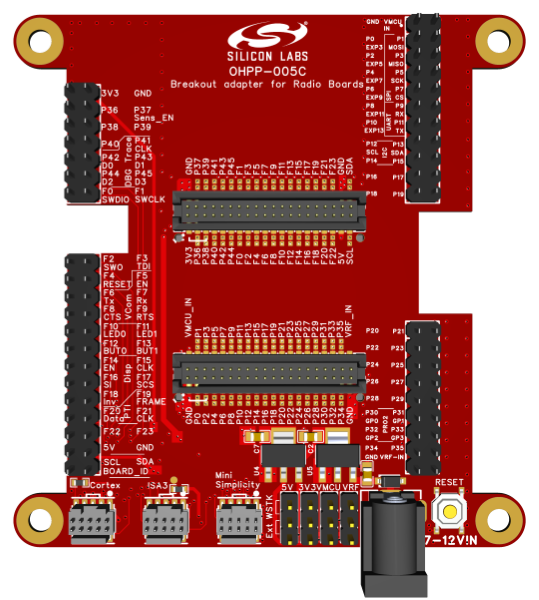|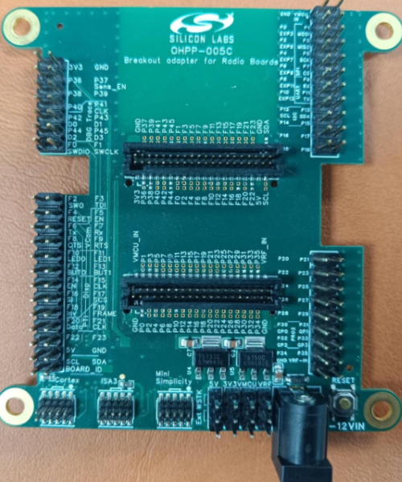|

### Features ###

- **Host MCU Reset Button**: Enables easy resetting of the microcontroller during development and testing.
- **Programming Headers**: Supports multiple interfaces including Cortex Debug, ISA3, and Mini Simplicity for flexible programming and debugging options.
- **Power Block**: Allows powering the board via a 9V adapter for standalone operation.

---

## Prerequisites ##

### Hardware ###

- Wireless Pro Kit Mainboard: BRD4001A, BRD4002A
- All Silicon Labs Radio Boards are supported
- [2-Position Shunt Connector](https://www.digikey.hk/en/products/detail/w%C3%BCrth-elektronik/60900213421/2508447)
- 9V Power Adapter

### Software ###

- [EasyEDA](https://easyeda.com/) - a free, PCB designer tool.

---

## What is included ##

### Design ###

We provide a design file named [ProDoc_OHPP_005C_WITH_POWER](./ProDoc_OHPP_005C_WITH_POWER.epro) that you can open and edit using EasyEDA software.

This [guide](https://prodocs.easyeda.com/en/import-export/import-easyeda-pro/) shows how to import it to EasyEDA tool.

### PCB/PCBA Order File ###

You can conveniently order the PCB/PCBA through JLCPCB using EasyEDA, ensuring that all specified requirements are met.

| **PCBA Order Settings**     | **Specifications**                   |
|-----------------------------|--------------------------------------|
| **Base Material**           | FR-4                                 |
| **Layers**                  | 6                                   |
| **Dimension**               | 61 mm * 80 mm                 |
| **Product Type**            | Industrial / Consumer Electronics    |
| **PCB Thickness**           | 1.6 mm                               |
| **Specify Stackup**         | No requirement                       |
| **Material Type**           | FR4 - Standard TG 135-140            |
| **Via Covering**            | Plugged                              |
| **Outer Copper Weight**     | 1 oz                                 |
| **Inner Copper Weight**     | 0.5 oz                               |
| **Mark on PCB**             | Order Number (Specify Position)      |
| **Min Via Hole Size**       | 0.3 mm (Diameter: 0.4 / 0.45 mm)     |
| **Appearance Quality**      | IPC Class 2 Standard                 |
| **Board Outline Tolerance** | ±0.2mm(Regular)                      |

> [!NOTE]
>
> [Gerber](./Gerber_OHPP_005C.zip), [Pick and Place](./PickAndPlace_OHPP_005C.xlsx), [BOM](./BOM_OHPP_005C_WITH_POWER.xlsx) files are also provided to easily work with other PCB/PCBA Manufacturers.

---

## User's Guide ##

### Hardware Installation Guide ###

#### Direct Pin Access ####

| Step | Description | Reference |
|------|-------------|-----------|
| 1 | Connect the breakout adapter board to the Wireless Pro Kit Mainboard |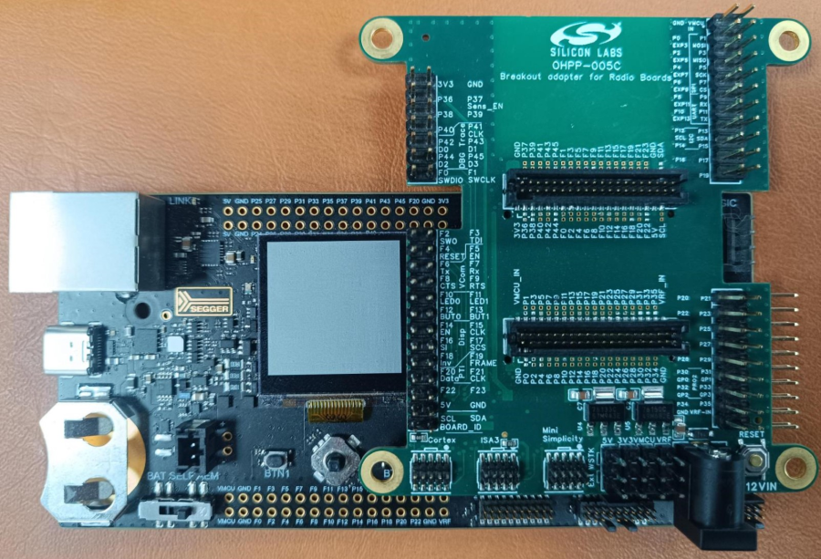|
| 2 | Connect the radio board to the breakout adapter board |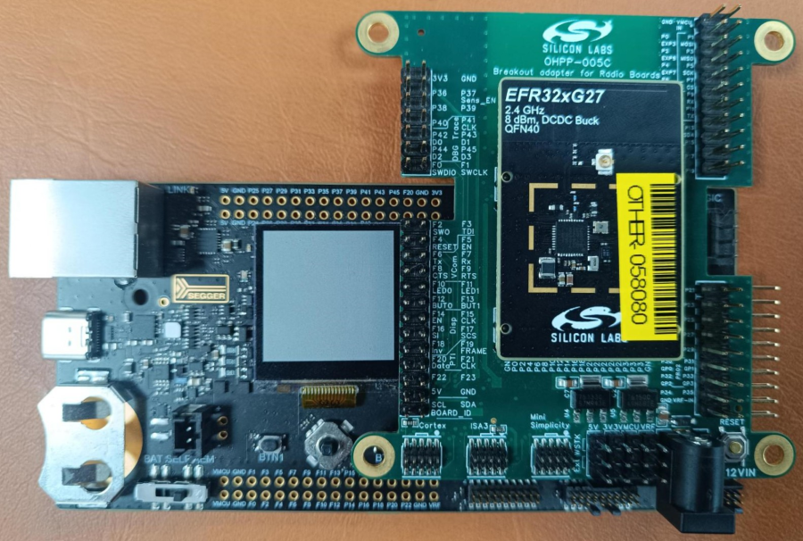|
| 3 | Use the shunt connector to select the desired voltage |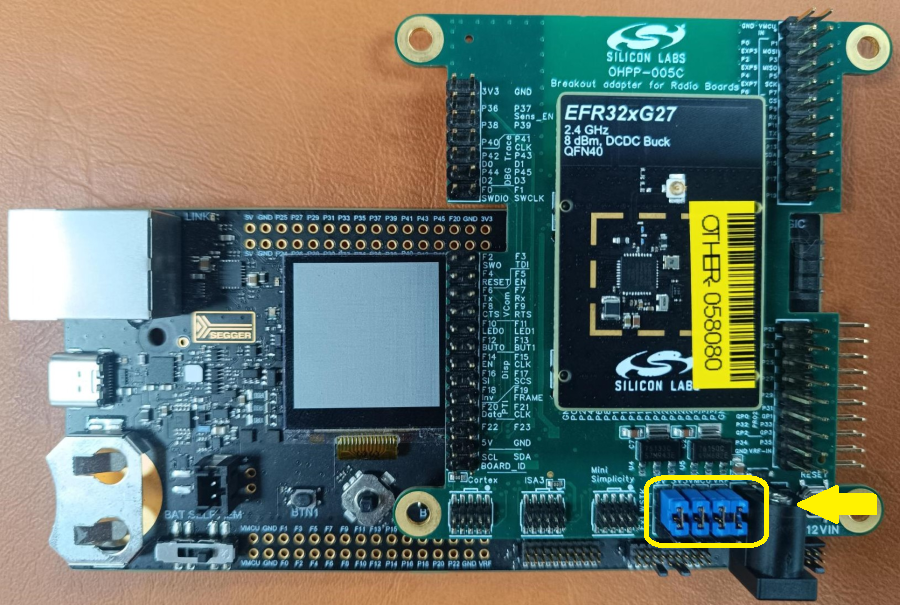|
| 4 | Power on the Wireless Pro Kit Mainboard via the USB, flash the radio board|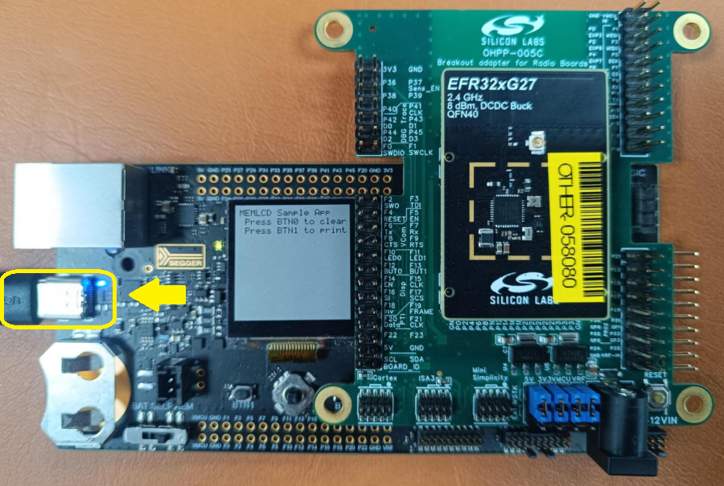|

#### Pin Access with External Power ####

| Step | Description | Reference |
|------|-------------|-----------|
| 1 | Connect the breakout adapter board to the Wireless Pro Kit Mainboard ||
| 2 | Connect the radio board to the breakout adapter board ||
| 3 | Use the shunt connector to select the desired voltage |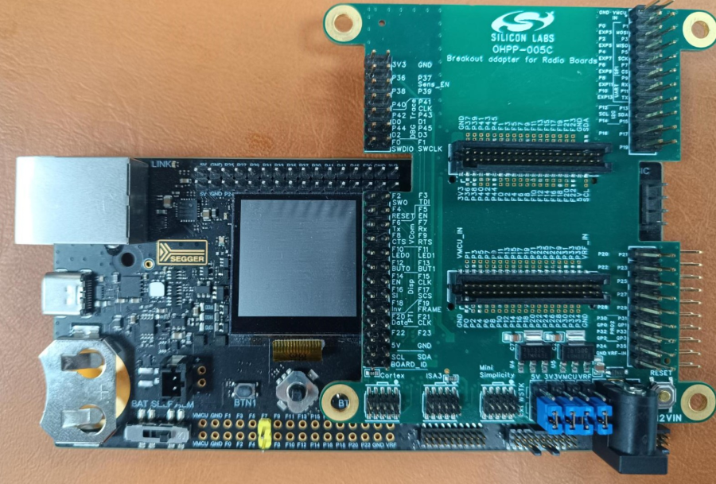|
| 4 | Power on the Wireless Pro Kit Mainboard via the USB, flash the radio board|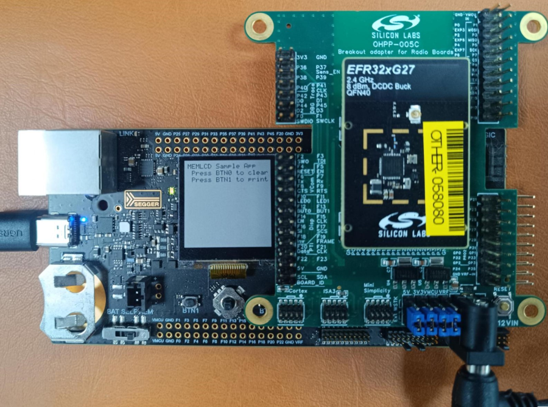|

#### Standalone Motherboard Mode ####

| Step | Description | Reference |
|------|-------------|-----------|
| 1 | Connect the radio board to the breakout adapter board | 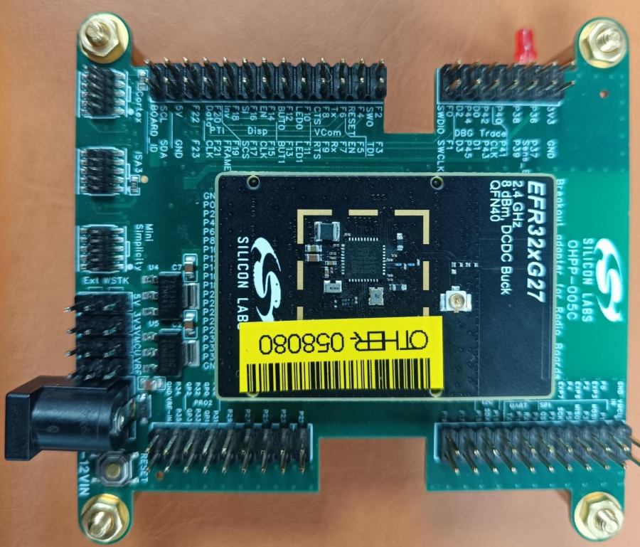 |
| 2 | Use the shunt connector to select the desired voltage |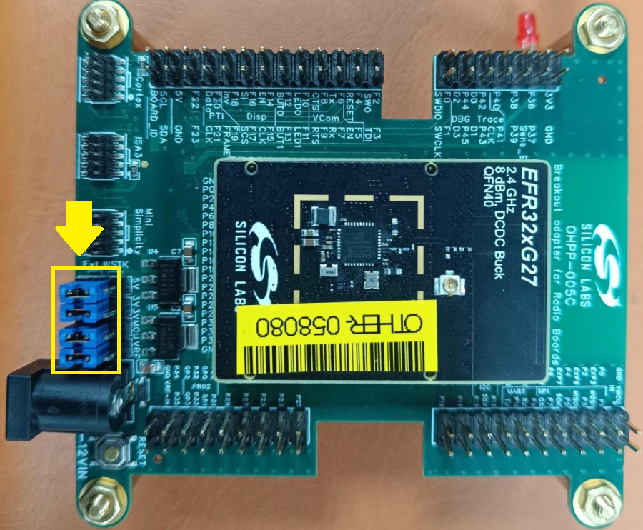|
| 3 | Connect the MINI cable from debugger to the MINI connector of breakout adapter |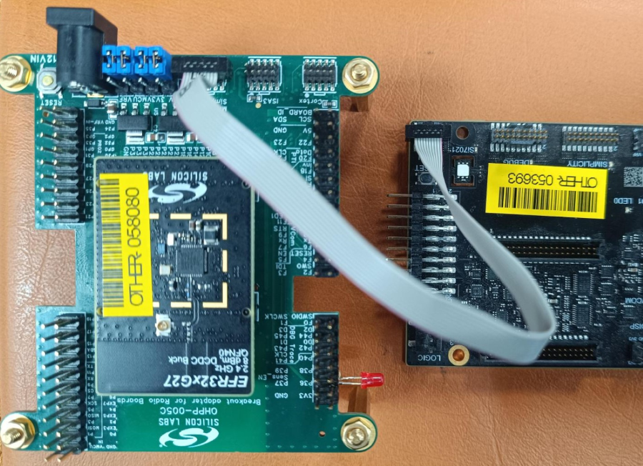|
| 4 | Power on the breakout board via 9V adapter, Flash the PF03 blink led project to the Radio board|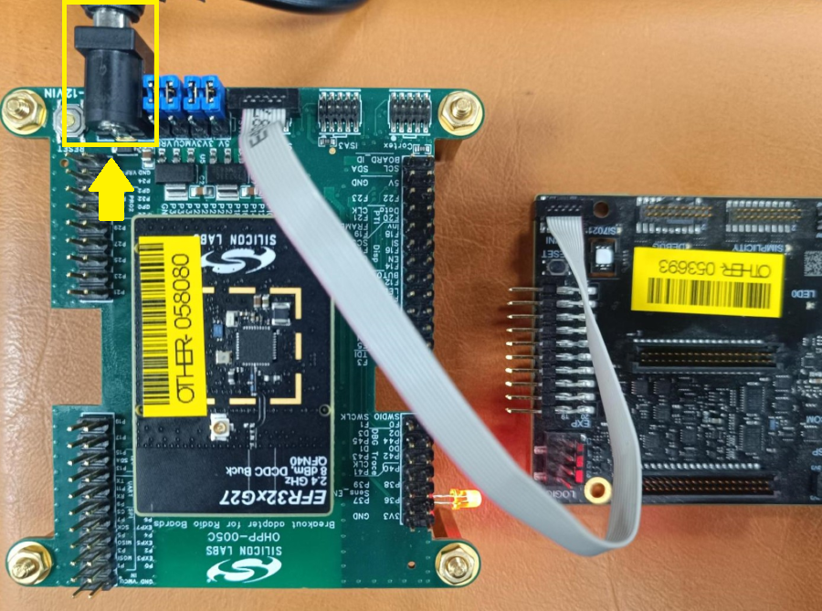|

---

## Report Defects & Get Support ##

To report defects in the Open PCB/PCBA Prototypes projects, please create a new "Issue" in the "Issues" section of [open_pcb_prototypes](https://github.com/SiliconLabsSoftware/open-pcb-prototypes) repo. Please reference the board, project, and relevant hardware design files associated with the flaws, and reference line numbers. If you are proposing a fix, also include information on the proposed fix. Since these examples are provided as-is, there is no guarantee that these examples will be updated to fix these issues.

Questions and comments related to these examples should be made by creating a new "Issue" in the "Issues" section of [open_pcb_prototypes](https://github.com/SiliconLabsSoftware/open-pcb-prototypes) repo.

---
