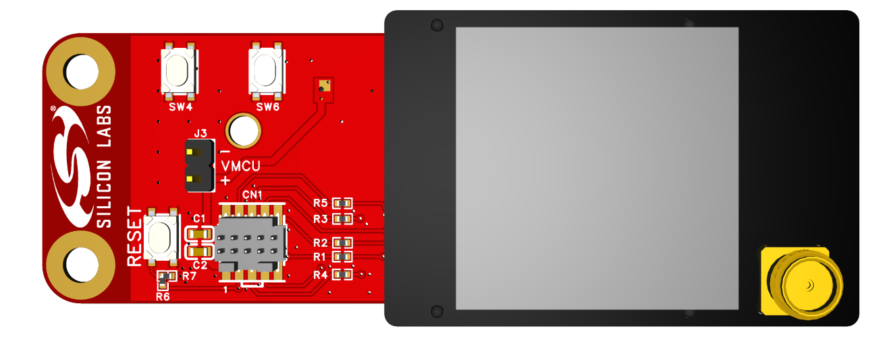
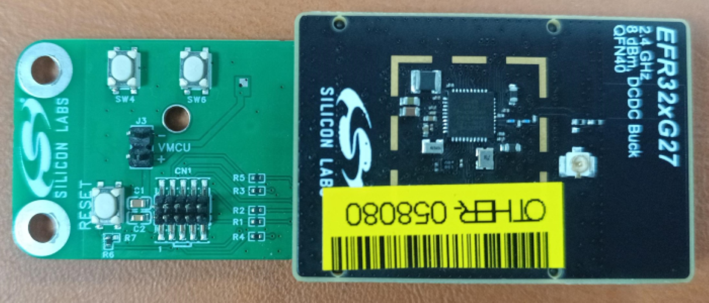
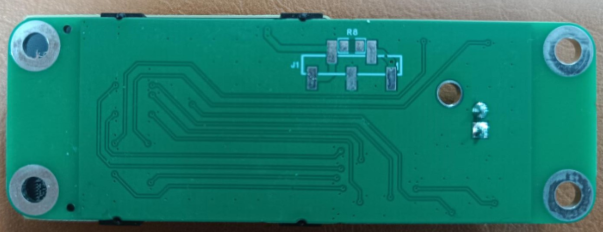
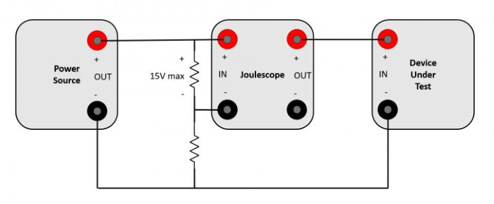

# Silicon Labs Joule Scope Adapter For Radio Boards #

## Overview ##

**Joule Scope Adapter** is a breakout adapter board provides a streamlined solution for connecting a Silicon Labs radio board directly to a JouleScope™ header. It is specifically designed to facilitate advanced power consumption analysis, debugging, and tracing, enabling developers to precisely measure and optimize the energy efficiency of their wireless applications.

---

## Table Of Contents ##

- [Hardware Overview](#hardware-overview)
  - [Feature](#feature)
- [Prerequisites](#prerequisites)
  - [Hardware](#hardware)
  - [Software](#software)
- [What is included in the Joule Scope project](#what-is-included-in-the-joule-scope-project)
  - [Design](#design)
  - [PCB/PCBA Order File](#pcbpcba-order-file)
- [User's Guide](#users-guide)
  - [Hardware Installation Guide](#hardware-installation-guide)
- [Report Defects & Get Support](#report-defects--get-support)

---

## Hardware Overview ##

| **3D render**     | **Real Board**                   |
|-----------------------------|--------------------------------------|
|  |                            |

### Feature ###

- **Radio Board Connector:** Enables seamless connection to Silicon Labs radio boards.
- **Mini Simplicity Connector:** Facilitates programming of the radio board using an external programmer.
- **Host MCU Reset Button:** Allows convenient resetting of the host microcontroller.
- **Dual Target MCU Buttons:** Provide button signal for the radio board.
- **Host MCU Voltage Connector (3.3V):** Provides the operating voltage for the host MCU via a jumper.

---

## Prerequisites ##

### Hardware ###

- [Position Shunt Connector](https://www.digikey.hk/en/products/detail/w%C3%BCrth-elektronik/60900213421/2508447) - Required for proper board connections
- 3.3 V external power source with 3.3 V and GND leads
- **All** Silicon Labs Radio Boards are supported.

### Software ###

- [EasyEDA](https://easyeda.com/) - a free, PCB designer tool.

---

## What is included in the Joule Scope project ##

### Design ###

We provide a design file named [ProDoc_OHPP-004_Joule_Scope](./ProDoc_OHPP-004_Joule_Scope.epro) that you can open and edit using EasyEDA software.

This [guide](https://prodocs.easyeda.com/en/import-export/import-easyeda-pro/) shows how to import it to EasyEDA tool.

### PCB/PCBA Order File ###

You can conveniently order the PCB/PCBA through JLCPCB using EasyEDA, ensuring that all specified requirements are met.

| **PCBA Order Settings**     | **Specifications**                   |
|-----------------------------|--------------------------------------|
| **Base Material**           | FR-4                                 |
| **Layers**                  | 2                                    |
| **Dimension**               | 77.50 mm × 26.60 mm                  |
| **Product Type**            | Industrial / Consumer Electronics    |
| **PCB Thickness**           | 1.6 mm                               |
| **Specify Stackup**         | No requirement                       |
| **Material Type**           | FR4 - Standard TG 135-140            |
| **Via Covering**            | Plugged                              |
| **Outer Copper Weight**     | 1 oz                                 |
| **Inner Copper Weight**     |                                      |
| **Mark on PCB**             | Order Number (Specify Position)      |
| **Min Via Hole Size**       | 0.3 mm (Diameter: 0.4 / 0.45 mm)     |
| **Appearance Quality**      | IPC Class 2 Standard                 |
| **Board Outline Tolerance** | ±0.2mm(Regular)                      |

> [!NOTE]
>
> [Gerber](./Gerber_JouleScope.zip), [Pick and Place](./PickAndPlace_JouleScope.xlsx), [BOM](./BOM_JouleScope.xlsx) files are also provided to easily work with other PCB/PCBA Manufacturers.

---

## User's Guide ##

### Hardware Installation Guide ###

| Step | Action | Reference |
|------|--------|-----------|
| 1 | Insert the Silicon Labs radio board into the adapter’s radio board connector |  |
| 2 | Place the position shunt connector or 0R resistor to connect pin 2 and 4 of J1 jumper ||
| 3 | connect the IN+ IN- connector of the JouleScope to the 3.3 power sourse ||
| 4 | connect the OUT+ OUT- connector of the JouleScope to the 3.3V and GND jumper connector on the top side of the break out board ||
| 5 | Program (flash) the radio board through the Mini Simplicity connector and do the power consumtion testing ||

## Report Defects & Get Support ##

To report defects in the Open PCB/PCBA Prototypes projects, please create a new "Issue" in the "Issues" section of [open_pcb_prototypes](https://github.com/SiliconLabsSoftware/open-pcb-prototypes) repo. Please reference the board, project, and relevant hardware design files associated with the flaws, and reference line numbers. If you are proposing a fix, also include information on the proposed fix. Since these examples are provided as-is, there is no guarantee that these examples will be updated to fix these issues.

Questions and comments related to these examples should be made by creating a new "Issue" in the "Issues" section of [open_pcb_prototypes](https://github.com/SiliconLabsSoftware/open-pcb-prototypes) repo.

---
