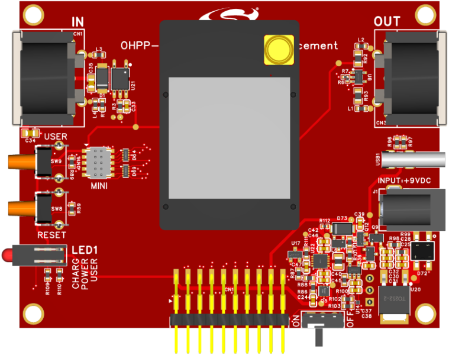
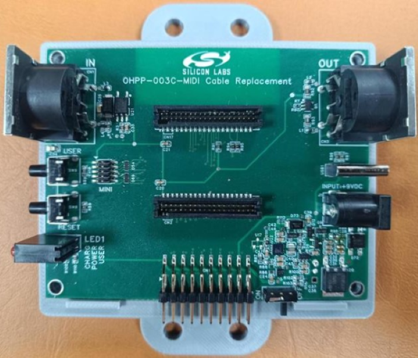
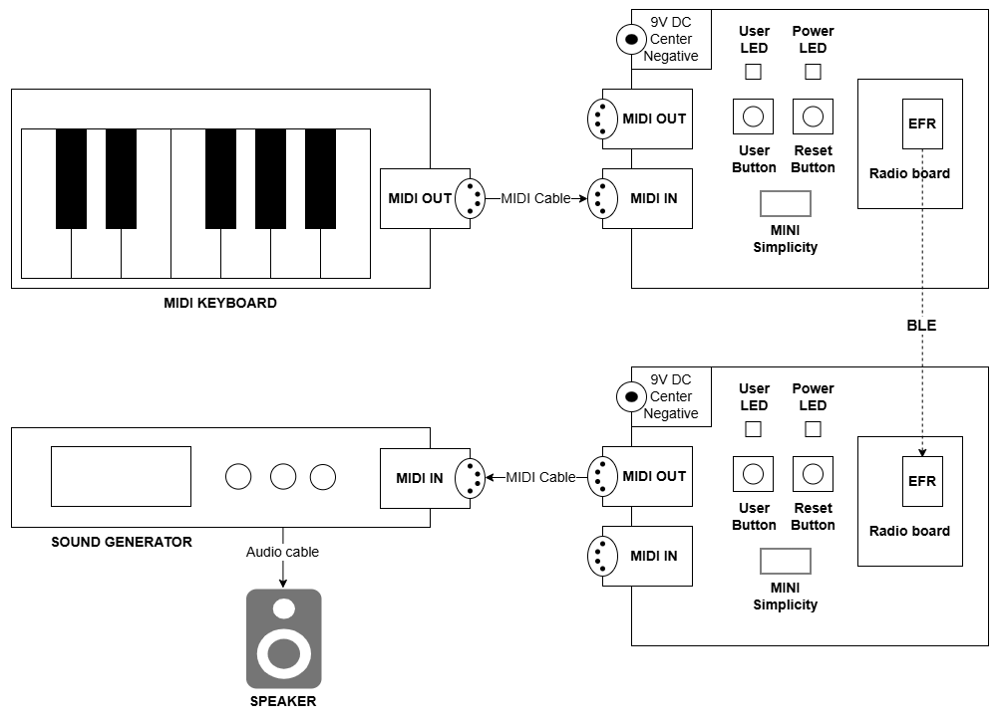
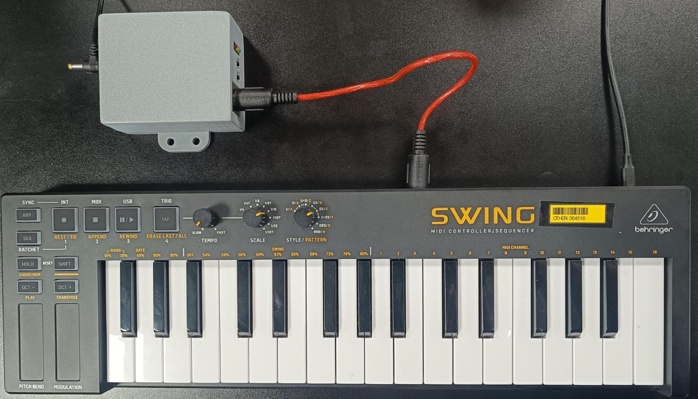
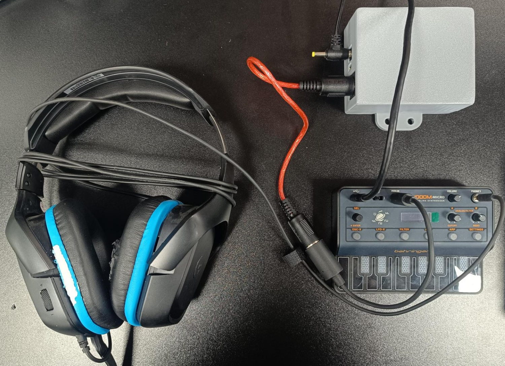
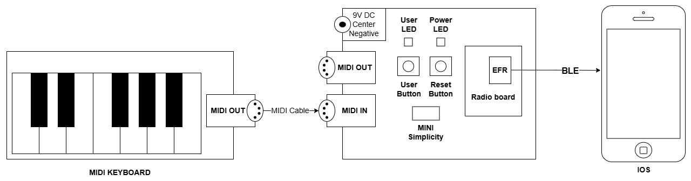

# Silicon Labs MIDI Cable Replacement Board #

## Overview ##

**MIDI Cable Replacement Board** is a dedicated board that showcases how to transfer and receive MIDI messages over a Silicon Labs wireless link. This innovative solution eliminates the need for traditional MIDI cables by providing a wireless alternative for MIDI communication between musical instruments and devices. Built on a 4-layer PCB with professional-grade specifications, this prototype demonstrates practical wireless MIDI implementation using Silicon Labs technology.

---

## Table Of Contents ##

- [Hardware Overview](#hardware-overview)
  - [Features](#features)
- [Prerequisites](#prerequisites)
  - [Hardware](#hardware)
  - [Software](#software)
- [What is included in the MIDI Cable Replacement Board project](#what-is-included-in-the-midi-cable-replacement-board-project)
  - [Design](#design)
  - [PCB/PCBA Order File](#pcbpcba-order-file)
- [User's Guide](#users-guide)
  - [Hardware Installation Guide](#hardware-installation-guide)
  - [Software Guide](#software-guide)
- [Report Defects & Get Support](#report-defects--get-support)

---

## Hardware Overview ##

| **3D Render**     | **Real board**                   |
|-----------------------------|--------------------------------------|
|       |                 |

### Features ###

- **Two standard 5-pin DIN MIDI connectors:** Enable MIDI input and output connectivity for musical instruments and devices.
- **Multiple Power Options:** Supports powering the board via a 9V DC adapter, USB Type-C, or a lithium battery.
- **USER LED:** Connected to the D9 pin on the Arduino shield connector for user-defined signaling.
- **POWER LED:** Provides a clear indication of board power status.
- **CHARGING LED:** Indicates the battery charging status.
- **USER button:** Allows user-triggered actions and interactions.
- **RESET button:** Allows convenient resetting of the host microcontroller.
- **Expansion Header:** Provides access to various signals for testing and debugging purposes.

---

## Prerequisites ##

### Hardware ###

- 1x 9VDC power adapter
- 1x Lithium battery (50x34x05mm)
- 1x MIDI cable
- 1x USB Type-C cable
- Supported Radio Boards:
  - [XGM240-RB4318A](https://www.silabs.com/development-tools/wireless/xgm240-rb4318a-xgm240s-sip-module-radio-board?tab=overview)
  - [xG23-RB4210A Radio Board](https://www.silabs.com/development-tools/wireless/xg23-rb4210a-efr32xg23-868-915-mhz-20-dbm-radio-board?tab=overview)
- Sound Generator (JT-4000M MICRO (only the 4000M version has MIDI in!))
- MIDI controller or keyboard with MIDI DIN TX connector Behringer Swing (Arturia clone) <https://www.behringer.com/product.html?modelCode=0715-AAL>
- Enclosure

> [!NOTE]
>
> The list of supported Radio Boards is updated frequently.

### Software ###

- [EasyEDA](https://easyeda.com/) - a free, PCB designer tool.

---

## What is included in the MIDI Cable Replacement Board project ##

### Design ###

We provide a design file named [ProDoc_OHPP_003A_MIDI_B](./ProDoc_OHPP_003A_MIDI_B.epro) that you can open and edit using EasyEDA software.

This [guide](https://prodocs.easyeda.com/en/import-export/import-easyeda-pro/) shows how to import it to EasyEDA tool.

### PCB/PCBA Order File ###

You can conveniently order the PCB/PCBA through JLCPCB using EasyEDA, ensuring that all specified requirements are met.

| **PCBA Order Settings**     | **Specifications**                   |
|-----------------------------|--------------------------------------|
| **Base Material**           | FR-4                                 |
| **Layers**                  | 4                                   |
| **Dimension**               | 90x86mm               |
| **Product Type**            | Industrial / Consumer Electronics    |
| **PCB Thickness**           | 1.6 mm                               |
| **Specify Stackup**         | No requirement                       |
| **Material Type**           | FR4 - Standard TG 135-140            |
| **Via Covering**            | Plugged                              |
| **Outer Copper Weight**     | 1 oz                                 |
| **Inner Copper Weight**     | 0.5 oz                               |
| **Mark on PCB**             | Order Number (Specify Position)      |
| **Min Via Hole Size**       | 0.3 mm (Diameter: 0.4 / 0.45 mm)     |
| **Appearance Quality**      | IPC Class 2 Standard                 |
| **Board Outline Tolerance** | ±0.2mm(Regular)                      |

> [!NOTE]
>
> [Gerber](./Gerber_OHPP_003_MIDI_B.zip), [Pick and Place](./PickAndPlace_OHPP_003_MIDI_B.xlsx), [BOM](./BOM_OHPP_003A_MIDI_B.xlsx) files are also provided to easily work with other PCB/PCBA Manufacturers.

---

## User's Guide ##

### Hardware Installation Guide ###

Follow these steps to set up your MIDI Cable Replacement Board:

#### Midi DIN to DIN over BLE ####

| Step | Description | Image |
|------|-------------|-------|
| 1 | Follow [software guide](#software-guide) to flash the radio boards that will be used in the MIDI devices. | |
| 2 | <ul><li>Connect the MIDI OUT port of the keyboard to the MIDI IN connector on one of the MIDI Cable Replacement Boards.</li><li>Power ON the MIDI device via 9V adapter, turn the power switch to ON.</li><li>Power ON the Keyboard via USB cable.</li></ul> |  |
| 3 | <ul><li>Connect the MIDI IN port of the Sound Generator to the MIDI OUT connector on the other MIDI Cable Replacement Board.</li><li>Power ON the MIDI device via 9V adapter, turn the power switch to ON.</li><li>Power ON the Sound Generator via USB cable.</li><li>Connect an audio cable from the 3.5 audio port of Sound Generator to a speaker or audio interface.</li></ul> |  |
| 4 | Play the keyboard. You should hear the sound from the Sound Generator through the speaker. | |

#### Midi DIN to BLE (SMART PHONE) ####

| Step | Description | Image |
|------|-------------|-------|
| 1 | Follow the [software guide](#software-guide) to flash the radio board that will be used in the MIDI device. | |
| 2 | <ul><li>Connect the MIDI OUT port of the keyboard to the MIDI IN connector on one of the MIDI Cable Replacement Boards.</li><li>Power ON the MIDI device via 9V adapter, turn the power switch to ON.</li><li>Power ON the Keyboard via USB cable.</li></ul> |  |
| 3 | Pair the MIDI device with the smartphone. | |
| 4 | Play the keyboard. You should see the signal on your phone. | |

### Software Guide ###

For detailed instructions on setting up and experimenting with the MIDI Cable Replacement Board module, please refer to the [MIDI Cable Replacement Board Software Examples](https://github.com/SiliconLabs/arduino/tree/main/libraries/SilabsBLEMIDI/examples). This resource provides comprehensive guides and example projects to help you get started with MIDI Cable Replacement Board software integration.

---

## Report Defects & Get Support ##

To report defects in the Open PCB/PCBA Prototypes projects, please create a new "Issue" in the "Issues" section of [open_pcb_prototypes](https://github.com/SiliconLabsSoftware/open-pcb-prototypes) repo. Please reference the board, project, and and relevant hardware design files associated with the flaws, and reference line numbers. If you are proposing a fix, also include information on the proposed fix. Since these examples are provided as-is, there is no guarantee that these examples will be updated to fix these issues.

Questions and comments related to these examples should be made by creating a new "Issue" in the "Issues" section of [open_pcb_prototypes](https://github.com/SiliconLabsSoftware/open-pcb-prototypes) repo.

---
