# Silicon Labs Si917 Controller Board #

## Overview ##

**Si917 Controller Board**  is a compact wireless controller board designed to host Silicon Labs Si917 radio modules for smart home applications. As a cost-effective alternative to the WSTK, it enables rapid development of Matter, Zigbee, and Thread-based home automation devices including lighting controls, sensors, and IoT gateways. The board accepts external power supply for both the radio module and connected smart home peripherals.

---

## Table Of Contents ##

- [Hardware Overview](#hardware-overview)
  - [Features](#features)
- [Prerequisites](#prerequisites)
  - [Hardware](#hardware)
  - [Software](#software)
- [What is included in the Si917 Controller Board project](#what-is-included-in-the-si917-controller-board-project)
  - [Design](#design)
  - [PCB/PCBA Order File](#pcbpcba-order-file)
- [User's Guide](#users-guide)
  - [Installation Guide](#installation-guide)
- [Report Defects & Get Support](#report-defects--get-support)

---

## Hardware Overview ##

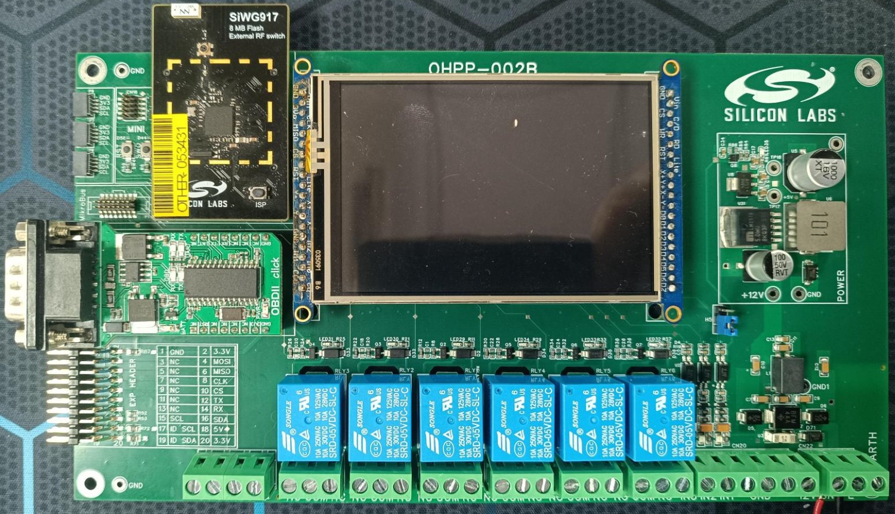

### Features ###

- **Power Input:** Accepts 9V or 12V from external power supply unit
- **Relay Outputs:** 6 relay channels for controlling external devices
- **Isolated input:** 3 Isolated inputs
- **MikroE MikroBUS Socket:** Compatible with MikroE Click boards
- **MikroE MikroBUS Shuttle Connector:** Additional expansion for MikroE modules
- **Qwiic Connectors:** 3 I2C interface connectors for easy sensor and peripheral integration
- **Debug Connector:** Simplicity Connector for programming and debugging
- **GPIO Expander Header:** Accessible GPIO pins for custom peripheral connections

---

## Prerequisites ##

### Hardware ###

- **12V DC Adapter:** Power supply for the controller board  
- **MikroE Sensors Click:** Expansion modules for sensor integration  
- **TFT_HXD8357:** Display module for visual output  

**Supported host boards:**  

- [SiWx917-RB4338A](https://www.silabs.com/development-tools/wireless/wi-fi/siwx917-rb4338a-wifi-6-bluetooth-le-soc-radio-board?tab=overview)

> [!NOTE]
>
> The list of supported hosts and Radio Boards is updated frequently.

### Software ###

- [EasyEDA](https://easyeda.com/) - a free, PCB designer tool.

---

## What is included in the Si917 Controller Board project ##

### Design ###

We provide a design file named [ProDoc_917_control_board_B](./ProDoc_917_control_board_B.epro) that you can open and edit using EasyEDA software.

This [guide](https://prodocs.easyeda.com/en/import-export/import-easyeda-pro/) shows how to import it to EasyEDA tool.

### PCB/PCBA Order File ###

You can conveniently order the PCB/PCBA through JLCPCB using EasyEDA, ensuring that all specified requirements are met.

| **PCBA Order Settings**     | **Specifications**                   |
|-----------------------------|--------------------------------------|
| **Base Material**           | FR-4                                 |
| **Layers**                  | 4                                    |
| **Dimension**               | 217 mm* 119.3 mm                 |
| **Product Type**            | Industrial / Consumer Electronics    |
| **PCB Thickness**           | 1.6 mm                               |
| **Specify Stackup**         | No requirement                       |
| **Material Type**           | FR4 - Standard TG 135-140            |
| **Via Covering**            | Plugged                              |
| **Outer Copper Weight**     | 1 oz                                 |
| **Inner Copper Weight**     | 0.5 oz                               |
| **Mark on PCB**             | Order Number (Specify Position)      |
| **Min Via Hole Size**       | 0.3 mm (Diameter: 0.4 / 0.45 mm)     |
| **Appearance Quality**      | IPC Class 2 Standard                 |
| **Board Outline Tolerance** | ±0.2mm(Regular)                      |

> [!NOTE]
>
> [Gerber](./Gerber_SiWG917_Control_Board_B.zip), [Pick and Place](./PickAndPlace_SiWG917_Control_Board_B.xlsx), [BOM](./BOM_917_control_board_B_SiWG917_Control_Board_B.xlsx) files are also provided to easily work with other PCB/PCBA Manufacturers.

---

## User's Guide ##

### Installation Guide ###

Before following all of the below steps, if you are using Simplicity MINI to flash the code, we suggest doing this first:

  1. Navigating to the **Debug Adapters** section, typically at the bottom left of your screen if you are using Simplicity Studio 5. Right click on the connected device and select the **Device Configuration...** window.

     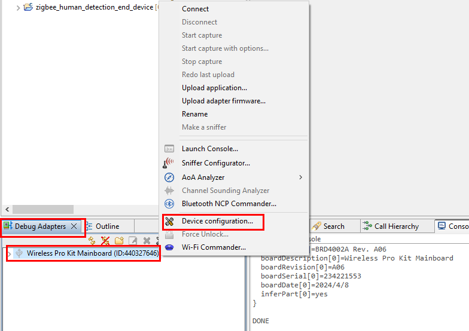

  2. Select the **Adapter Configuration** and choose the **Debug Mode** to MINI.

     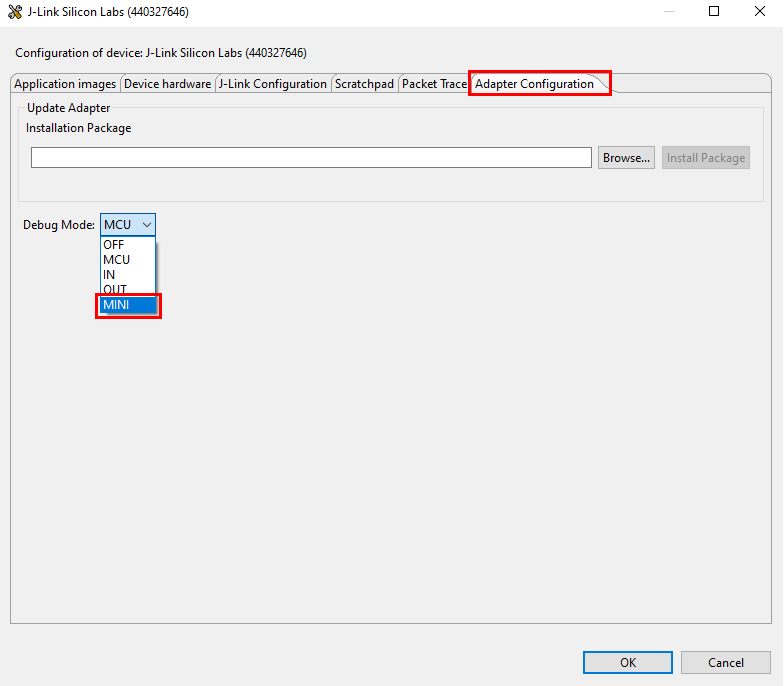

  3. Select the **Device Hardware** and manually type in your Silicon Labs Board.

     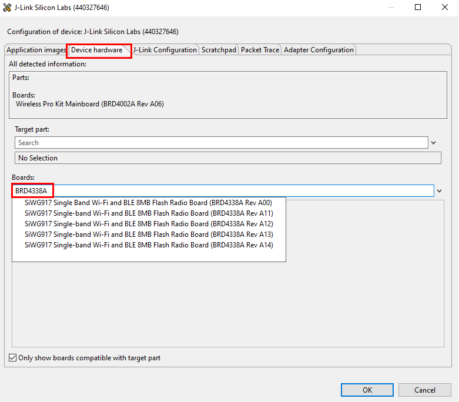

  4. You should be all set to go, select OK to close the window.

     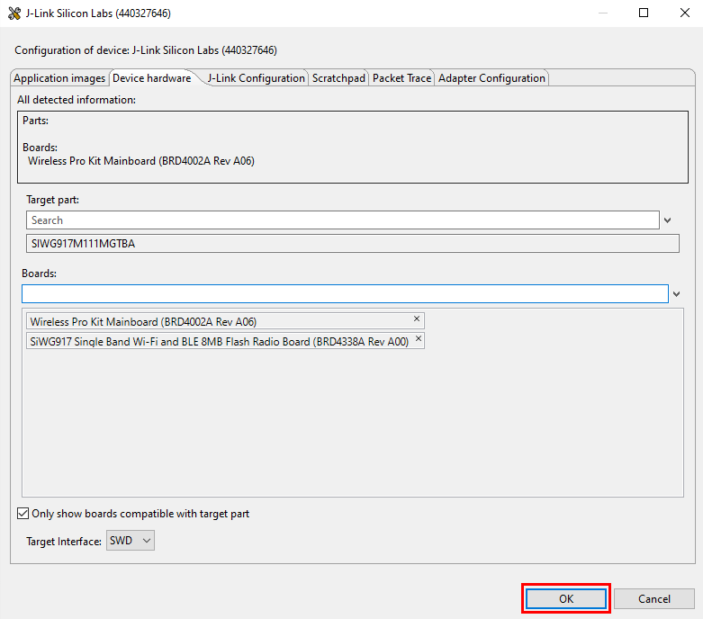

If you want to test the functionality of the Si917 Controller Board, follow these steps to set up your Si917 Controller Board:

#### Unit 1: Test 6 relays ####

| Step | Description | Comment/Image |
|------|-------------|---------------|
| 1 | Plug the Si917 Radio Board into the Controller Board. | 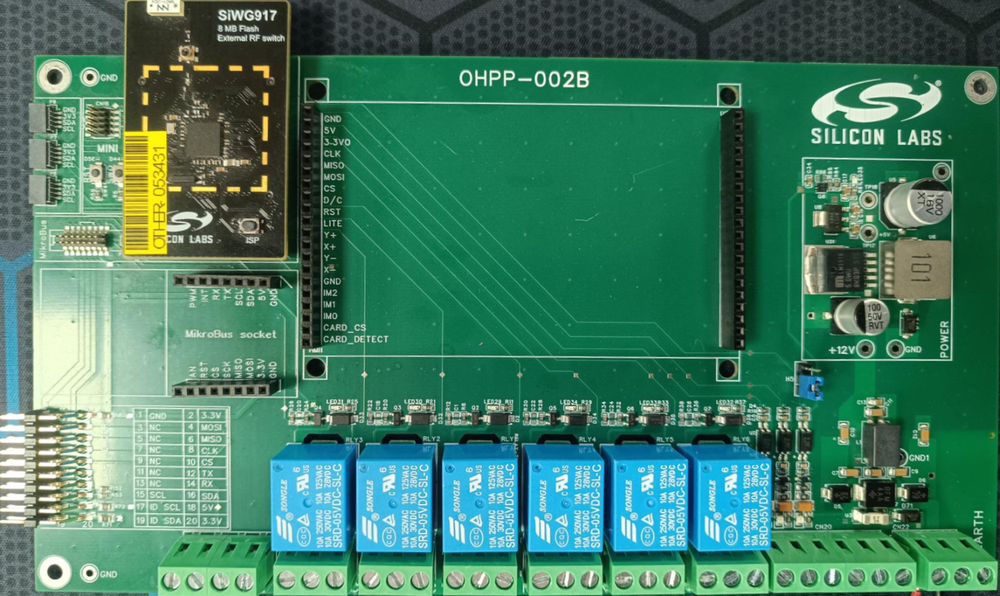 |
| 2 | Connect the MINI cable from the BRD4002A mainboard to the Si917 Controller Board. | 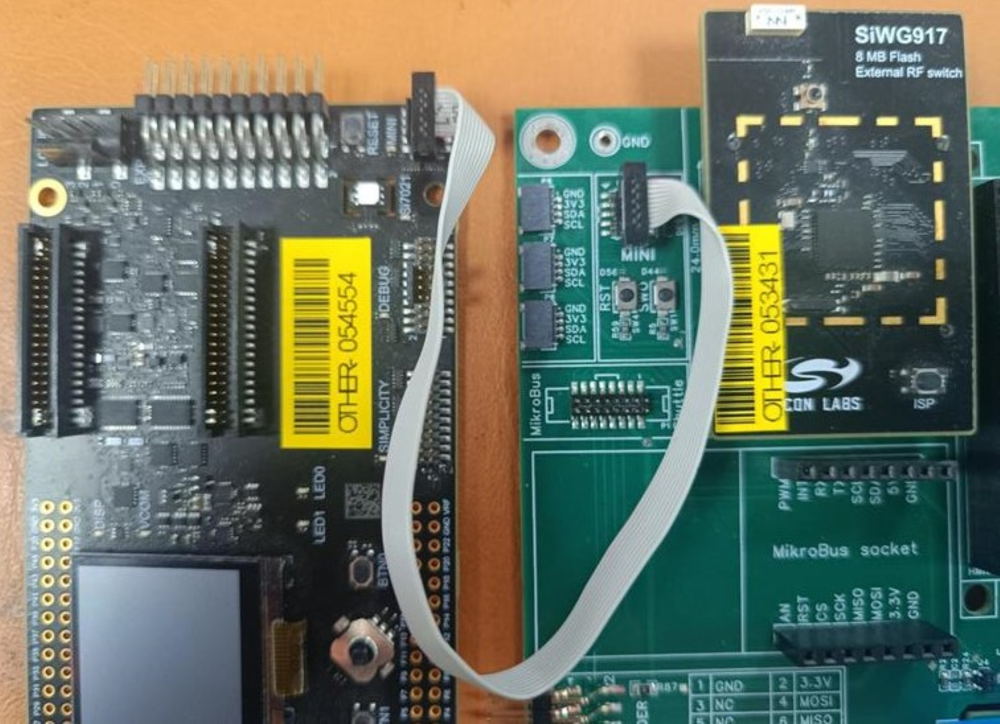 |
| 3 | Flash the `.hex` file to test the relay function. | [Relay Testing File](hex_files_to_test/FT003_6_relays.hex) |
| 4 | Check the result. | All the relays should be turned on and off in a fixed interval |

#### Unit 2: Test 3 Isolated Inputs ####

| Step | Description | Comment/Image |
|------|-------------|---------------|
| 1 | Plug the Si917 Radio Board into the Controller Board. |  |
| 2 | Connect the MINI cable from the BRD4002A mainboard to the Si917 Controller Board. |  |
| 3 | Flash the `.hex` file to test the relay function. | [Inputs Testing File](hex_files_to_test/FT004_test_3_isolated_inputs.hex) |
| 4 | Connect subsequently the IN1, IN2, IN3 to the GND for them to go from HIGH to LOW  | 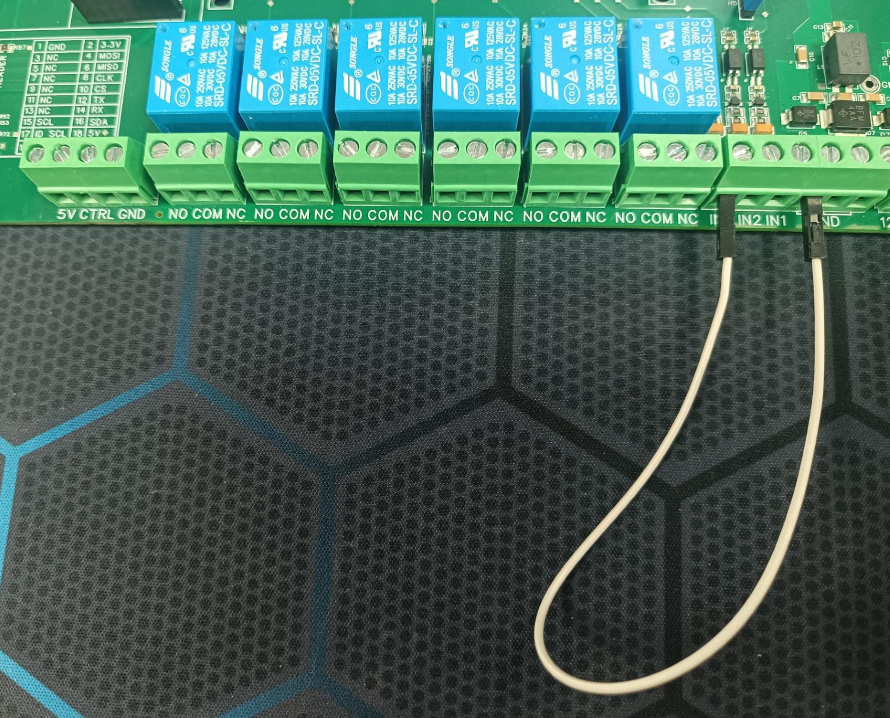 |
| 5 | Check the result. | The relay status should be switched if we change the input state |

#### Unit 3: Test the TFT HXD8357 ####

| Step | Description | Comment/Image |
|------|-------------|---------------|
| 1 | Plug the Si917 Radio Board into the Controller Board. |  |
| 2 | Plug the HXD8357 into the Controller Board. | 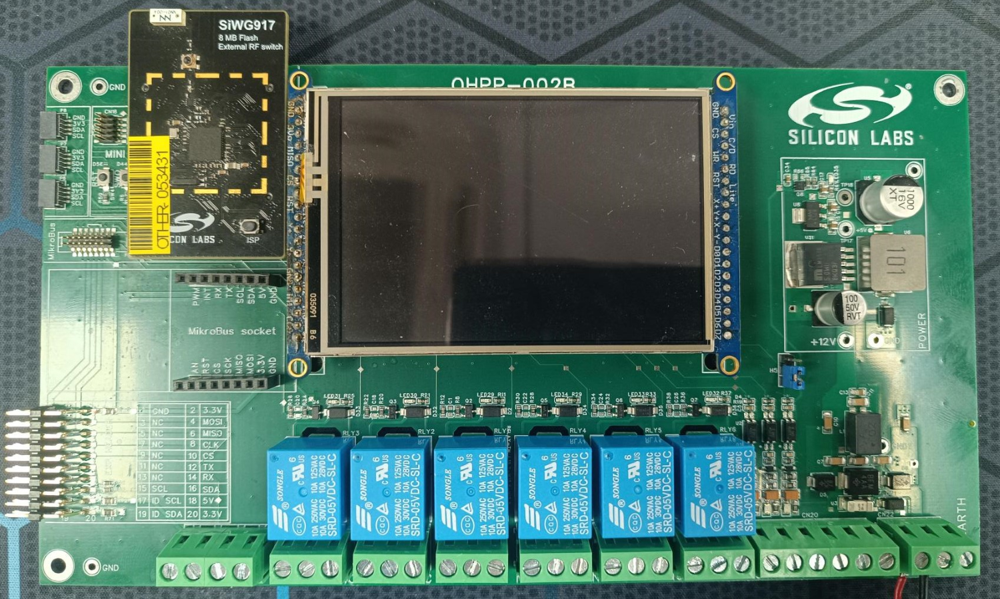 |
| 3 | Connect the MINI cable from the BRD4002A mainboard to the Si917 Controller Board. |  |
| 4 | Flash the `.hex` file to test the PWM function. | [HXD8357 Testing File](hex_files_to_test/FT005_HXD8357D_test.hex) |
| 5 | Press the RST button and check the result | It should display a screen that you can draw on it  |

#### Unit 4: Test the functions on the Mikrobus Socket ####

| Step | Description | Comment/Image |
|------|-------------|---------------|
| 1 | Plug the Si917 Radio Board into the Controller Board. |  |
| 2 | Connect the MINI cable from the BRD4002A mainboard to the Si917 Controller Board. |  |
| 3 | Flash the `.hex` file to test the PWM function. Use the Oscilloscope to see the duty cycle = 50% from the Mikrobus socket PWM pin | [PWM Mikrobus Socket Testing File](<hex_files_to_test/FT006_PWM_GPIO11_GPIO9.hex>) |
| 4 | Plug the UV Click into the Mikrobus socket on the Controller Board. | 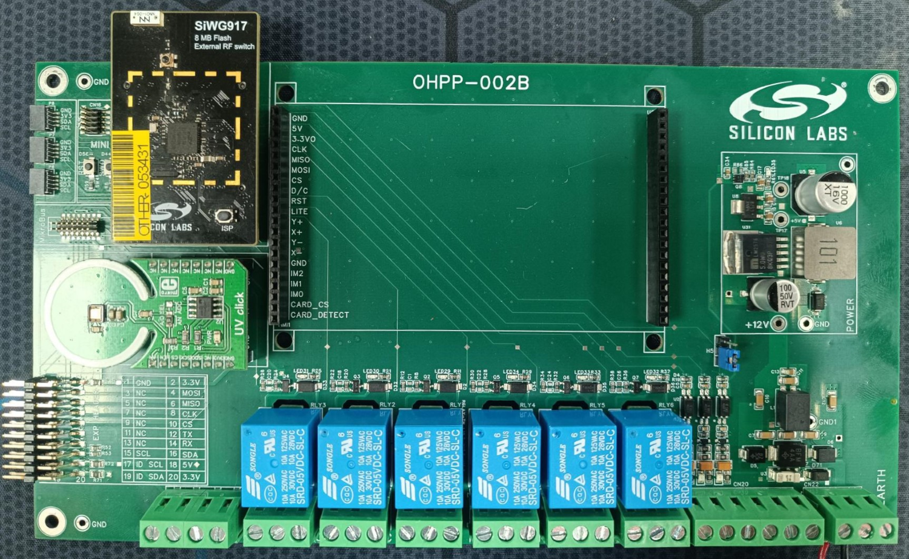 |
| 5 | Flash the `.hex` file to test the UV click. Check the log data | [UV Click Mikrobus Socket Testing File](hex_files_to_test/FT007_MikroBus_socket_UV_sensor.hex) |
| 6 | Plug the OBDII into the Mikrobus Socket on the Controller Board. | 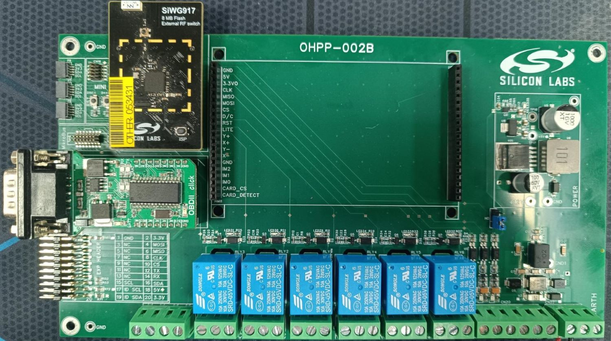 |
| 7 | Flash the `.hex` file to test the OBDII click. Check the log data | [OBDII Mikrobus Socket Testing File](hex_files_to_test/FT008_MikroBus_socket_obdii.hex) |
| 8 | Flash the `.hex` file to test the RST and INT pin. | [RST & INT Mikrobus Socket Testing File](hex_files_to_test/FT009_INT_RST_shuttle_and_socket_MikroBus.hex) |

#### Unit 5: Test the functions on the Mikrobus Shuttle ####

| Step | Description | Comment/Image |
|------|-------------|---------------|
| 1 | Plug the Si917 Radio Board into the Controller Board. |  |
| 2 | Connect the MINI cable from the BRD4002A mainboard to the Si917 Controller Board. |  |
| 3 | Flash the `.hex` file to test the PWM function. Use the Oscilloscope to see the duty cycle = 50% from the Mikrobus Shuttle PWM pin | [PWM Mikrobus Shuttle Testing File](hex_files_to_test/FT006_PWM_GPIO11_GPIO9.hex) |
| 4 | Plug the UV Click into the Controller Board. | 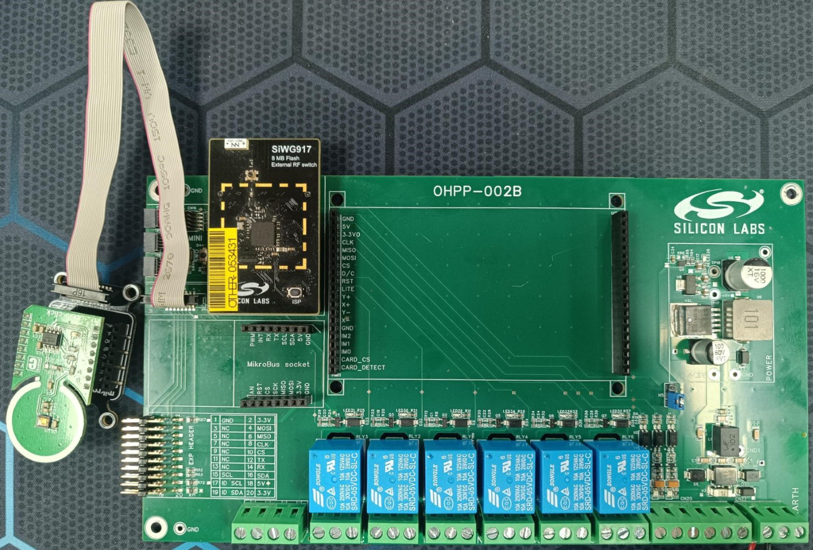 |
| 5 | Flash the `.hex` file to test the UV click. Check the log data | [UV Click Mikrobus Shuttle Testing File](hex_files_to_test/FT007_MikroBus_shuttle_UV_sensor.hex) |
| 6 | Plug the OBDII into the Controller Board. | 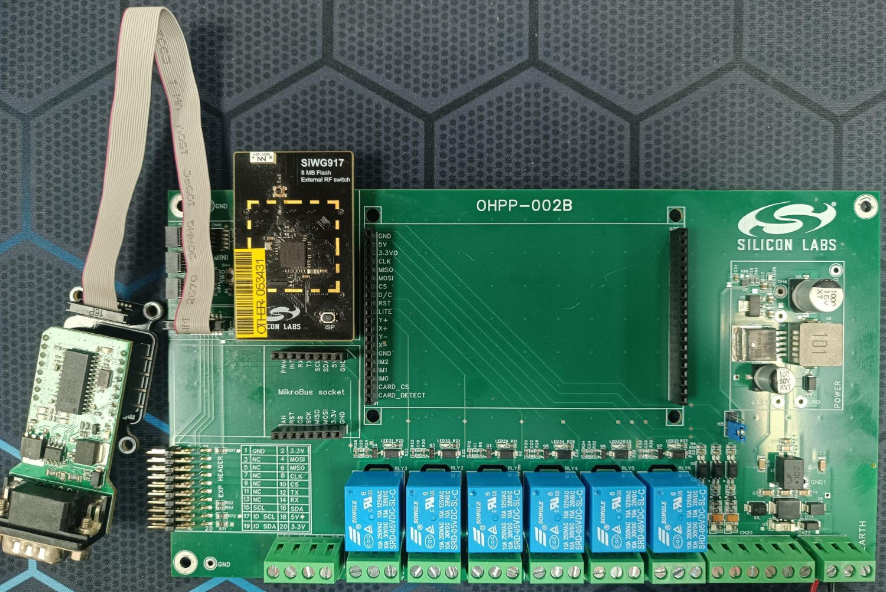 |
| 7 | Flash the `.hex` file to test the OBDII click. Check the log data | [OBDII Mikrobus Shuttle Testing File](hex_files_to_test/FT008_MikroBus_shuttle_obdii.hex) |
| 8 | Flash the `.hex` file to test the RST and INT pin. | [RST & INT Mikrobus Shuttle Testing File](hex_files_to_test/FT009_INT_RST_shuttle_and_socket_MikroBus.hex) |

---

## Report Defects & Get Support ##

To report defects in the Open PCB/PCBA Prototypes projects, please create a new "Issue" in the "Issues" section of [open_pcb_prototypes](https://github.com/SiliconLabsSoftware/open-pcb-prototypes) repo. Please reference the board, project, and relevant hardware design files associated with the flaws, and reference line numbers. If you are proposing a fix, also include information on the proposed fix. Since these examples are provided as-is, there is no guarantee that these examples will be updated to fix these issues.

Questions and comments related to these examples should be made by creating a new "Issue" in the "Issues" section of [open_pcb_prototypes](https://github.com/SiliconLabsSoftware/open-pcb-prototypes) repo.

---
